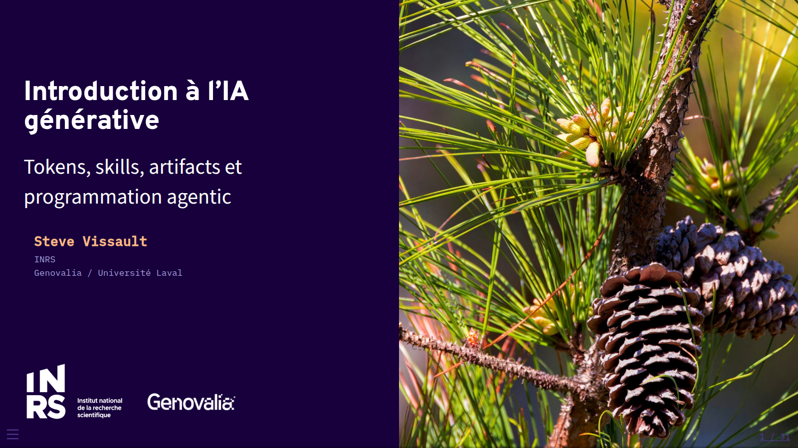

# Contexte : la course à l'overfitting {background-color="#17003C"}

## La croissance du nombre d'hyperparamètres {.smaller}

Depuis 2010, le nombre de paramètres des modèles d'IA les plus notables double environ chaque année.

{fig-align="center" width="65%"}

::: {.notes}
Source : ourworldindata.org/grapher/exponential-growth-of-parameters-in-notable-ai-systems (données Epoch AI, licence CC BY)
:::

## Pourquoi la pente change en 2010 ? {.smaller}

Avant 2010, le calcul d'entraînement doublait ~tous les 2 ans (rythme proche de la loi de Moore). Depuis 2010 : ~tous les 6 mois — le début de l'**ère du deep learning**.

- **GPU pour l'entraînement de réseaux de neurones** (dès 2009-2010) : rend soudainement abordable l'entraînement de modèles beaucoup plus grands
- **Le deep learning commence à battre les méthodes classiques** sur des tâches concrètes (parole ~2009-2011, vision avec ImageNet/AlexNet en 2012) → afflux d'investissement
- **Disponibilité de gros jeux de données** (ImageNet publié en 2009) pour nourrir des modèles plus grands

::: {.callout-note}
Epoch AI/Our World in Data situent cette date comme la frontière entre l'ère "pré-deep learning" et l'ère du deep learning dans leur base de données.
:::

## Une course qui ralentit sur un front, accélère sur un autre {.smaller}

- Les comptes de paramètres publiés stagnent depuis ~3 ans autour de 1000 milliards — **les labos ont cessé de les divulguer** (OpenAI, Anthropic, Google)
- Le calcul d'entraînement (compute), lui, continue de croître de 4-5× par an (Epoch AI)
- La course s'est déplacée : moins "plus de paramètres", plus **de données, de calcul au moment de l'inférence (reasoning), et d'outillage agentique**
- Investissements massifs en infrastructure (centres de données, puces) plutôt qu'en taille brute du modèle

## Les principaux fournisseurs {.smaller}

::: {style="font-size: 0.65em"}
| Fournisseur | Modèles phares | Approche |
|---|---|---|
| **Anthropic** | Claude (Opus, Sonnet, Haiku) | Propriétaire, focus sécurité/alignement |
| **OpenAI** | GPT, o-series | Propriétaire |
| **Google DeepMind** | Gemini | Propriétaire, intégré à l'écosystème Google |
| **Meta** | Llama | Poids ouverts |
| **xAI** | Grok | Propriétaire |
| **Mistral AI** | Mistral, Magistral | Mixte (ouvert + propriétaire), européen |
| **DeepSeek** | DeepSeek-V/R | Poids ouverts, entraînement très optimisé en coût |
:::

::: {.callout-note}
Paysage qui évolue vite — écarts de performance entre labos de tête de plus en plus faibles d'une génération à l'autre.
:::

# Tokens & contexte {background-color="#17003C"}

## C'est quoi un token ? {.smaller}

- Unité de découpage du texte (sous-mot, ~4 caractères en moyenne en anglais)
- Un modèle ne lit pas des mots ou des caractères, mais une **séquence de tokens**
- Tout compte comme tokens : prompt système, historique, résultats d'outils, images, réponse générée

**Exemple** (tokeniseur BPE, `cl100k_base`) :

<div style="font-family: 'IBM Plex Mono', monospace; font-size: 0.55em; line-height: 2.4; margin: 0.6em 0;">
<span style="background:#9478F8; color:#17003C; padding:2px 3px; border-radius:3px;">La</span><span style="background:#BCB9F2; color:#17003C; padding:2px 3px; border-radius:3px;">&nbsp;biod</span><span style="background:#FF6645; color:#17003C; padding:2px 3px; border-radius:3px;">ivers</span><span style="background:#9478F8; color:#17003C; padding:2px 3px; border-radius:3px;">ité</span><span style="background:#BCB9F2; color:#17003C; padding:2px 3px; border-radius:3px;">&nbsp;du</span><span style="background:#FF6645; color:#17003C; padding:2px 3px; border-radius:3px;">&nbsp;Québec</span><span style="background:#9478F8; color:#17003C; padding:2px 3px; border-radius:3px;">&nbsp;se</span><span style="background:#BCB9F2; color:#17003C; padding:2px 3px; border-radius:3px;">&nbsp;mesure</span><span style="background:#FF6645; color:#17003C; padding:2px 3px; border-radius:3px;">&nbsp;aussi</span><span style="background:#9478F8; color:#17003C; padding:2px 3px; border-radius:3px;">&nbsp;par</span><span style="background:#BCB9F2; color:#17003C; padding:2px 3px; border-radius:3px;">&nbsp;ses</span><span style="background:#FF6645; color:#17003C; padding:2px 3px; border-radius:3px;">&nbsp;sé</span><span style="background:#9478F8; color:#17003C; padding:2px 3px; border-radius:3px;">quences</span><span style="background:#BCB9F2; color:#17003C; padding:2px 3px; border-radius:3px;">&nbsp;gén</span><span style="background:#FF6645; color:#17003C; padding:2px 3px; border-radius:3px;">om</span><span style="background:#9478F8; color:#17003C; padding:2px 3px; border-radius:3px;">iques</span><span style="background:#BCB9F2; color:#17003C; padding:2px 3px; border-radius:3px;">.</span>
</div>

17 tokens pour 71 caractères / 11 mots — noter les mots découpés en morceaux (`biod|ivers|ité`, `sé|quences`, `gén|om|iques`)

::: {.callout-note}
1 token ≈ 0,75 mot (anglais). Le français tokenise généralement un peu moins efficacement.
:::

## La fenêtre de contexte {.smaller}

La "context window" = tout ce que le modèle peut voir en même temps (mémoire de travail, pas la mémoire d'entraînement).

{fig-align="center" width="70%"}

::: {.notes}
Source : platform.claude.com/docs/en/build-with-claude/context-windows
:::

## Taille de contexte par modèle {.smaller}

- Modèles récents (Sonnet 5, Opus 5, Fable 5.1, …) : **1 million de tokens**
- Modèles antérieurs (Sonnet 4.5, Haiku 4.5) : **200 000 tokens**
- Plus de contexte ≠ toujours mieux : au-delà d'un certain seuil, la précision se dégrade (*context rot*) → curer ce qu'on met dans le contexte compte autant que sa taille

## Le coût des modèles {.smaller}

Facturation au token, prix différents pour l'entrée (input) et la sortie (output) — l'output coûte typiquement 5× l'input.

| Modèle | Input ($/M tokens) | Output ($/M tokens) |
|---|---|---|
| Haiku 4.5 | 1 | 5 |
| Sonnet 5 | 2 | 10 |
| Opus 5 | 5 | 25 |
| Fable 5 / 5.1 | 10 | 50 |

::: {.callout-note}
Le cache de prompt réduit le coût d'un contexte répété jusqu'à 90 % (hit = 10 % du prix input standard).
:::

# Skills {background-color="#17003C"}

## C'est quoi un skill ? {.smaller}

- Un dossier structuré d'instructions (+ scripts, ressources) que l'agent peut découvrir et charger au besoin
- Permet d'**empaqueter et partager un savoir-faire** (un prompt, une procédure, un style) plutôt que de le retaper à chaque fois
- Chaque skill = un fichier `SKILL.md` (nom, description, instructions), avec fichiers optionnels dans `/scripts`, `/references`, `/assets`

## Pourquoi c'est utile en équipe {.smaller}

- Standardise une procédure récurrente (ex. : template de rapport, checklist de revue de code, style de commit)
- Se partage comme du code : un dossier versionné dans un dépôt ou un plugin
- **Progressive disclosure** : l'agent ne voit d'abord qu'une courte description ; il charge le détail seulement s'il en a besoin → économise des tokens de contexte

::: {.callout-note}
Référence : platform.claude.com/docs/en/agents-and-tools/agent-skills/overview — dépôt d'exemples : github.com/anthropics/skills
:::

## Exemple de skill {.smaller}

`.claude/skills/couverture-genomique/SKILL.md` — standardise la génération du graphique de couverture pour l'équipe :

```markdown
---
name: couverture-genomique
description: >
  Génère le graphique de couverture génomique par statut de risque
  (LEMV/COSEPAC) à partir du pipeline QCGenomLandscape. Utiliser quand on
  demande un résumé ou une figure de couverture par statut de conservation.
---

1. Charger les données via `load_risk_status()`
2. Appeler `plot_risk_status_coverage(risk_genes, jurisdiction = "QC")`
3. Exporter en PNG + SVG dans `results/`
4. Résumer les 3 statuts avec la plus faible couverture en 2 phrases
```

- N'importe qui de l'équipe tape "génère la couverture génomique" → même figure, mêmes conventions, à chaque fois
- Le skill vit dans le dépôt, versionné et revu comme du code

# Artifacts {background-color="#17003C"}

## C'est quoi un artifact ? {.smaller}

- Un contenu généré par l'agent (code, document, page web, visualisation) affiché à part de la conversation, dans son propre espace
- Vit dans son propre "espace de travail" : on peut le rouvrir, le mettre à jour, le partager par lien
- Contrairement à un bloc de code dans le chat, il est **persistant et interactif** (ex. : une page HTML qui tourne réellement, un tableau qu'on peut re-render)

## Cas d'usage typiques {.smaller}

- Prototype d'interface ou de visualisation à itérer sans réécrire toute la conversation
- Document destiné à être partagé/édité par d'autres personnes
- Rapport, dashboard ou diagramme qui doit rester consultable après la session

## Exemple 1 — Un design (cette présentation) {.smaller}

Cette présentation elle-même (thème Genovalia) est un exemple d'artifact : générée, itérée et mise à jour dans une conversation, réutilisable telle quelle.

{fig-align="center" width="70%"}

## Exemple 2 — Une visualisation de données {.smaller}

Un graphique produit dans le cadre du projet de portrait génomique (pipeline `QCGenomLandscape`) : couverture génomique par statut de risque (LEMV/COSEPAC).

{fig-align="center" width="55%"}

# MCP {background-color="#17003C"}

## C'est quoi le Model Context Protocol ? {.smaller}

- Standard ouvert (Anthropic, nov. 2024) pour connecter un agent à des données et des outils externes
- Avant MCP : une intégration sur mesure par outil/API → travail dupliqué pour chaque agent et chaque source
- Avec MCP : un seul protocole, deux rôles — un **serveur** qui expose des capacités, un **client** qui s'y connecte

::: {.callout-note}
Analogie : un port USB-C pour les agents — un connecteur standard plutôt qu'un câble propriétaire par appareil.
:::

## Structure d'un projet MCP (serveur Python) {.smaller}

```
weather-server/
├── pyproject.toml
└── src/weather/
    ├── server.py       # FastMCP("weather") — point d'entrée
    ├── tools.py        # @mcp.tool()     → get_forecast(), get_alerts()
    ├── resources.py    # @mcp.resource() → données exposées (lecture seule)
    └── prompts.py      # @mcp.prompt()   → gabarits réutilisables
```

- Un module = une capacité : fonctions Python décorées, découvertes automatiquement par le SDK
- Le nom de fonction + sa docstring **sont** ce que l'agent voit pour décider quand l'appeler

## Exemple : une fonction (tool) et un prompt {.smaller}

```python
from mcp.server.fastmcp import FastMCP

mcp = FastMCP("weather")

@mcp.tool()
async def get_forecast(latitude: float, longitude: float) -> str:
    """Get the weather forecast for a location."""
    ...

@mcp.prompt()
def summarize_alerts(state: str) -> str:
    """Template prompt: summarize active weather alerts for a state."""
    return f"Résume les alertes météo actives pour {state}."
```

- **Tool** = une action que l'agent peut invoquer directement
- **Prompt** = un gabarit réutilisable que l'humain ou l'agent déclenche pour lancer une tâche standard

::: {.notes}
Source : modelcontextprotocol.io/quickstart/server, github.com/modelcontextprotocol/python-sdk
:::

## Ce qu'un serveur MCP peut exposer {.smaller}

- **Tools** : des actions que l'agent peut invoquer (appel d'API, requête, calcul)
- **Resources** : des données de contexte (contenu de fichier, enregistrement, réponse d'API)
- **Prompts** : des gabarits d'interaction réutilisables

- Écosystème déjà riche de serveurs communautaires (GitHub, Slack, bases de données, …) : brancher un agent sur un nouvel outil devient une question de configuration, pas de développement

# Programmation agentic {background-color="#17003C"}

## Le bloc de base : le LLM augmenté {.smaller}

Un modèle seul répond ; un modèle **augmenté** peut chercher de l'information, appeler des outils et garder de la mémoire.

{fig-align="center" width="65%"}

## La boucle agentique {.smaller}

Un agent = un LLM qui utilise des outils **en boucle**, en se basant sur le retour de l'environnement à chaque étape (résultat d'outil, sortie de code) pour ajuster la suite.

{fig-align="center" width="60%"}

::: {.notes}
Source : anthropic.com/engineering/building-effective-agents
:::

## Exemple concret : un agent de code {.smaller}

{fig-align="center" width="45%"}

- Lit le code existant, planifie, édite des fichiers, exécute des tests
- Ground truth à chaque étape (résultat de test, sortie de commande) plutôt qu'un seul gros prompt

## Workflows vs agents {.smaller}

- **Workflow** : chemin prédéfini, le code orchestre le LLM et les outils (prévisible, plus simple à déboguer)
- **Agent** : le LLM décide lui-même de la suite des actions (flexible, adapté aux tâches ouvertes/imprévisibles)
- Recommandation Anthropic : commencer simple (un seul appel, un workflow), n'ajouter une boucle agentique que si la tâche l'exige vraiment

# Ce que ça implique pour les devs {background-color="#17003C"}

## Pistes de réflexion {.smaller}

- Le rôle du dev glisse vers la **revue et l'orchestration** : lire/valider du code produit par un agent plutôt que taper chaque ligne
- Risque de perte de compréhension fine du code si on accepte sans relire — la dette technique peut devenir invisible
- Un agent avec accès à des outils (MCP, exécution de code, accès réseau) a une **surface d'action réelle** — les erreurs ne restent pas dans le chat
- Données sensibles (ex. données génomiques, spécimens, coordonnées d'espèces menacées) : ce qui part dans un prompt/contexte quitte votre machine — vérifier les politiques de rétention/entraînement du fournisseur
- Coût et contexte ne sont pas gratuits : un agent qui boucle mal peut consommer beaucoup de tokens pour peu de valeur

## Bonnes pratiques {.smaller}

- **Toujours relire et tester** le code/les résultats générés avant de les intégrer — jamais de merge sans revue humaine
- Donner un contexte **précis et curé** plutôt que tout déverser dans le prompt (context engineering > gros contexte)
- Itérer par petites étapes vérifiables (ground truth à chaque étape : test qui passe, sortie de commande) plutôt qu'un seul gros prompt
- Standardiser les tâches d'équipe récurrentes avec des **skills versionnés**, revus comme du code
- Choisir le modèle selon la tâche (Haiku pour du simple/rapide, Sonnet/Opus pour du complexe) et utiliser le cache de prompt pour limiter les coûts
- Ne jamais connecter un agent à des serveurs MCP ou des identifiants non fiables/non vérifiés
- Garder un humain responsable de la décision finale, surtout sur du code scientifique/publié

# Merci {background-color="#17003C"}

## Questions {.smaller}

Steve Vissault — INRS / Genovalia
